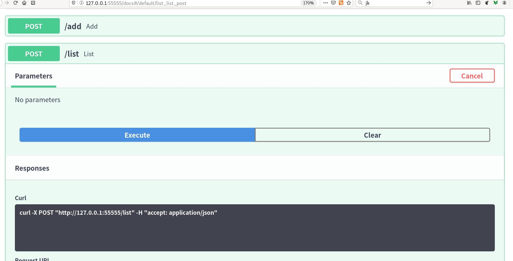
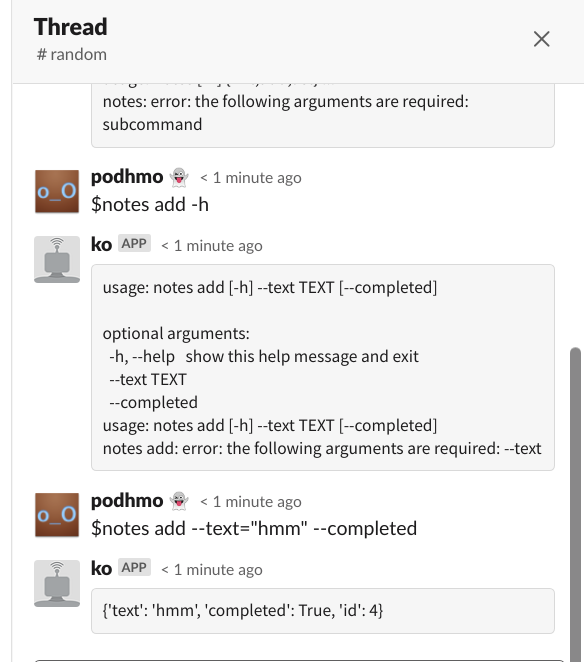
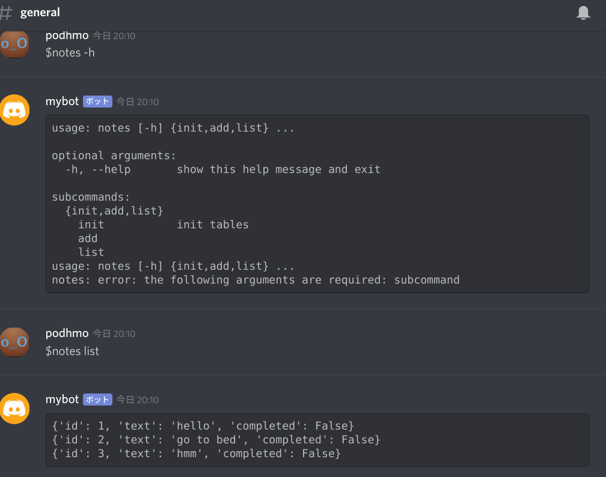

# notes

Tiny todo app like example, something like described by below pages.

- https://www.starlette.io/database/
- https://fastapi.tiangolo.com/tutorial/async-sql-databases/

## cli

```console
# init db
$ make init
python -m monogusa.cli cli.py init
$ ls *.db
test.db

# add notes
$ make add
python -m monogusa.cli cli.py add --text="hello"
{'text': 'hello', 'completed': False, 'id': 1}
$ make add TEXT="go to bed"
python -m monogusa.cli cli.py add --text="go to bed"
{'text': 'go to bed', 'completed': False, 'id': 2}

# list
$ make list
python -m monogusa.cli cli.py list
{'id': 1, 'text': 'hello', 'completed': False}
{'id': 2, 'text': 'go to bed', 'completed': False}
```

## as webAPI

- every endpoint is POST
- interactive API documentation via swaggerUI

```console
$ make ui-web
python -m monogusa.web cli.py --dst .
[F]     update  ./web.py
python web.py --port=55555
Now go to http://127.0.0.1:55555/docs.
You will see the automatic interactive API documentation 
INFO:     Started server process [104421]
INFO:     Uvicorn running on http://127.0.0.1:55555 (Press CTRL+C to quit)
INFO:     Waiting for application startup.
INFO:     Application startup complete.
```



## as slackbot

:warning: need `SLACKCLI_API_TOKEN`

```console
$ make ui-slack
python -m monogusa.chatbot.slackcli cli.py --name=notes
```



## as discordbot

:warning: need `DISCORDCLI_API_TOKEN`

```console
$ make ui-discord
python -m monogusa.chatbot.discordcli cli.py --name=notes
```

on discord


